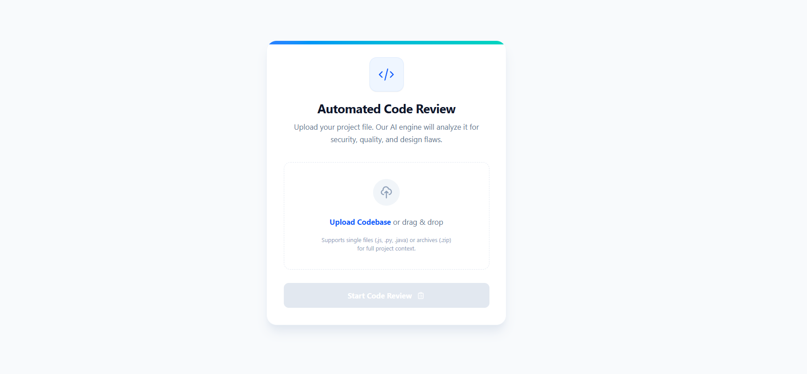
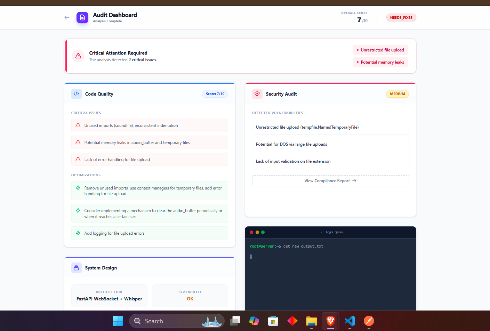

# 🚀 Codebase Review Agent

Codebase Review Agent is an AI-powered full-stack application that analyzes uploaded codebases and automatically generates structured reports for code quality, security risks, system design, and production readiness using LLM APIs. Built with FastAPI on the backend and React + Vite on the frontend, it allows users to upload a ZIP project, process it through AI analysis, and view clean JSON-based review insights in a modern dashboard interface, helping developers quickly identify issues, improve architecture, and prepare projects for production deployment.

### Upload Page

### Report Dashboard

## ✨ Features

- 🤖 AI-powered automated code review  
- 🔐 Security vulnerability detection  
- 🏗 System architecture evaluation  
- 📊 Production readiness analysis  
- 📦 Upload entire project as ZIP  
- ⚡ Fast JSON structured reports  
- 🎯 Clean and modern UI dashboard  

---

## 🛠 Tech Stack

### Backend
- FastAPI  
- Python  
- LLM API (Gemini / OpenAI)  
- Springboot

### Frontend
- React + Vite  
- Tailwind CSS  